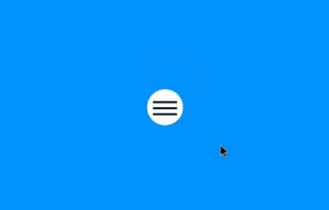

# Burger Menu Button - CSS Animation

<p align="center">
  
</p>

# Tutorial

_in html file_

First, let's create an ` input ` element in the `chekbox` type with an id of `"hamburger-menu"`:

```html
<input id="hamburger-menu" type="checkbox">
```

Now, let's create a `label` for this input:

```html
<label for="hamburger-menu"></label>
```

Within this label, we will add a `div` element with the class `"button"`:

```html
<div class="button"></div>
```

Within this div, we will add a `span` element with the `line` class:

```html
<span class="line"></span>
``` 

The result of the HTML part will be:

```html
<input id="hamburger-menu" type="checkbox">
<label for="hamburger-menu">
    <div class="button">
        <span class="line"></span>
    </div>
</label>
```

***

_in CSS file_

Let's change our `div` element with the `"button"` class. I set the size to 60 pixels in height and width, I also defined a 50% radius for the border (with the `border-radius`) and the white background.

```CSS
.button {
    width: 60px;
    height: 60px;
    border-radius: 50%;
    background-color: white;
}
```

## Why?

I love web designs, and I do them because I mostly had a problem with that and I know a lot of people do too. So I made this repository for many people to learn and not have problems like I did.

## About this repository

This repository was made to teach how to make a hamburger menu button with just a few lines of code and Javascript is not used.

## About this project

This project has the main purpose of teaching and learning a little about design, and will help from beginners to those who already know a lot about the subject. This project is open source so you can use it for whatever you want: Apps, webpages or make money from it.

## More about the author

I basically love the art of programming or design, I'm a Fullstack developer and sometimes I make games in Javascript. I am 18 years old and have no academic training. I create open source code for everyone who wants to help me by correcting my code or giving me suggestions for improvements.

## License

This code is open source so you can use it as you like without worrying about copying rights.